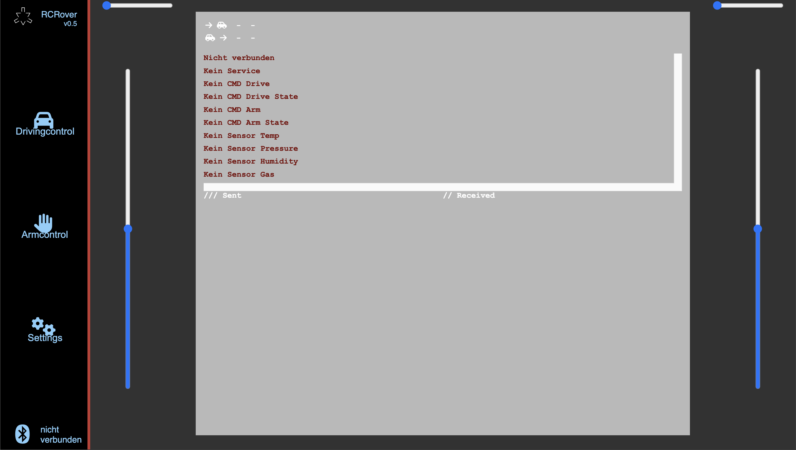
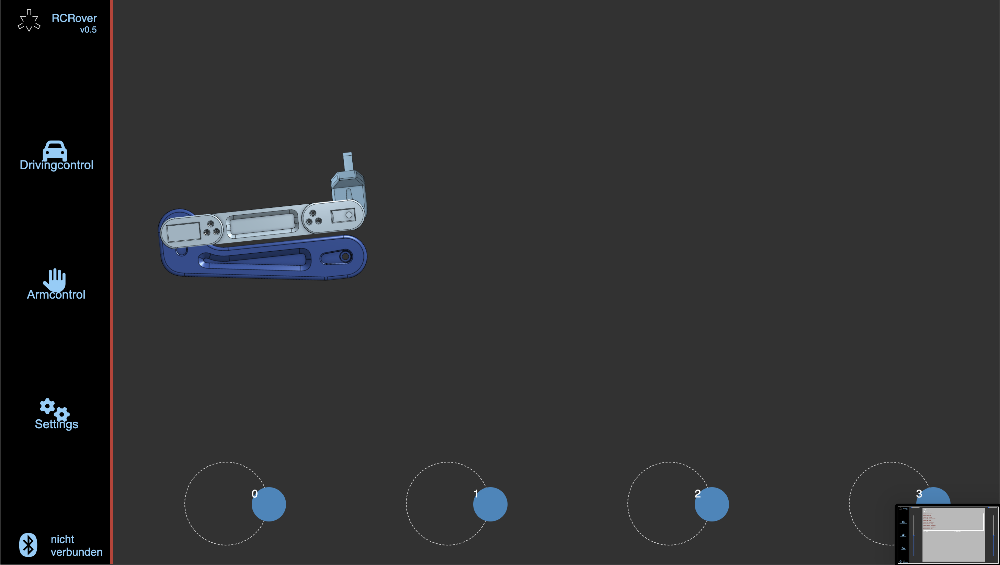
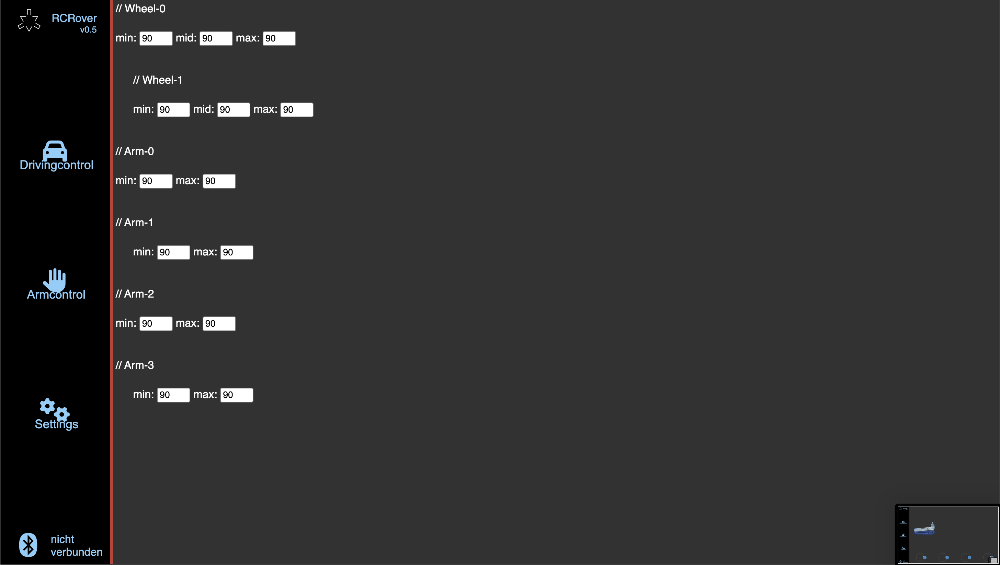
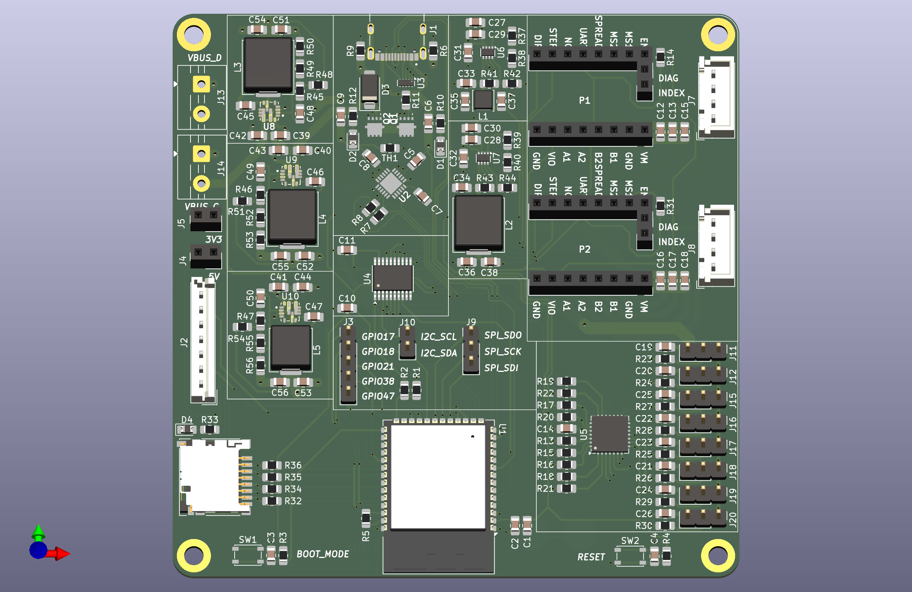
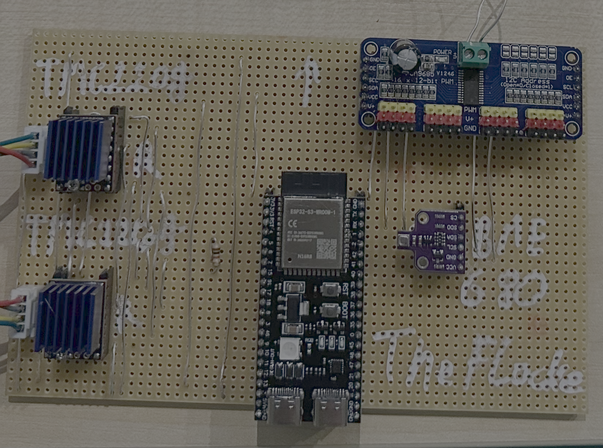
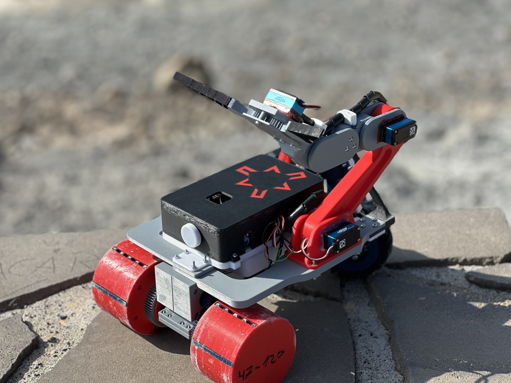

# RC Rover 🌋
## TODO
- Settings Page zuende bauen
- Slider für Stolen zuende bauen
- Interpolation
- Datenbank für Sensordaten
- Stromstärke messen Servo
- Wheel assembly guide through websiet (easier to do without power supply)

This project was developed as part of a high school competition organized by the German Aerospace Center (DLR). The challenge: design and build a rover capable of:
- 📊 Collecting sensor data
- 🧭 Navigating autonomously
- 🦾 Using a robotic arm to gather rock samples

To enable wireless control from any BLE-capable device, I developed:
- 💻 Custom microcontroller software
- 🌐 Dedicated web app
- 🖥️ Bespoke PCB design (unfortunately, the PCB was never manufactured due to supply issues)

The foundation for the code was a project from my teacher, which I significantly modified and expanded. While I focused on electronics/software ⚡️, my teammates handled mechanical engineering ⚙️.

## Project Screenshots 📸

## Installation ⚙️
### 🔌 Flash mcu-sw onto the ESP32
#### 1. 📋 Install Prerequisites
You’ll need VS Code or CLion with the PlatformIO extension.  
See the Links section below for tutorials.

#### 2. 💾 Download the Project
Clone or download this repository and open it in your chosen IDE.

#### 3. 🆔 Generate New UUIDs
1. Open `ESP32ble.h`  
2. Visit [uuidgenerator.net](https://www.uuidgenerator.net/)  
3. Generate new UUIDs and replace existing ones

#### 4. ⚡ Flash the ESP32
Upload the code to your ESP32 device.

#### 5. 📶 Test BLE Communication
Use nRF Connect or similar BLE apps to verify data transmission.

## Acknowledgements 🙏
- 👨‍🏫 [RC Car Project by my Teacher](https://github.com/bkZuendorf/rc-car)
- 🖨️ [3D-Printable Parts Repository](https://github.com/matiassingers/awesome-readme)

## Authors 👥
- [@TheFlocke](https://github.com/TheFlocke) 👤
- [@xNiicki](https://github.com/xNiicki) 👤
